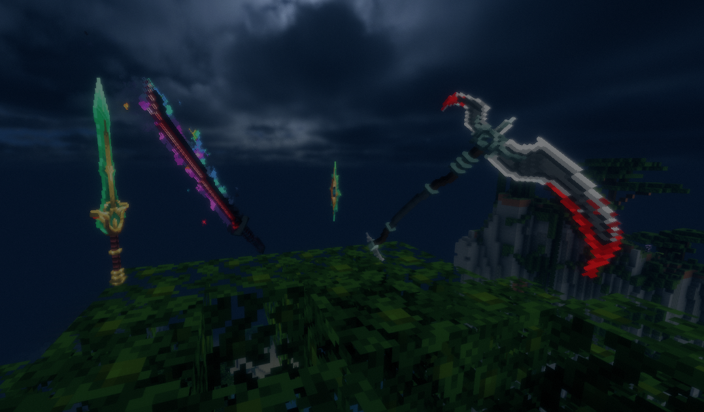
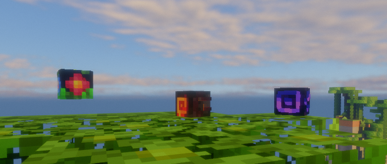
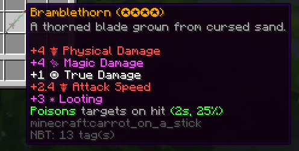
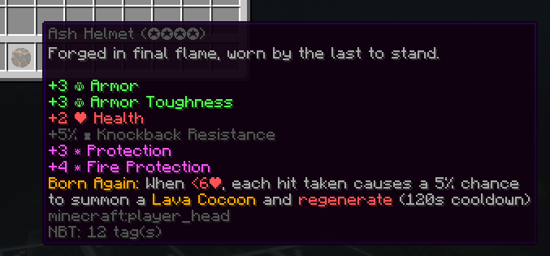

# Custom Items
This server features dozens of customized mobs, weaponry, and mobs. This wiki page contains spoilers.

# Weapons
This server features 35+ custom weapons, all of which are obtained either by mob drop or by [rune crafting](#runes-crafting). All custom weapons are silently equipped with Looting III, and cannot be enchanted, renamed, repaired, or broken.

## Weapon Drops
Many weapons are random drops from custom mobs. Some weapons are more rare than others.

<strong>Click to view eligible mob weapon drops</strong>

The following weapons are eligible to drop from mobs:

<ul>
  <li><strong>Grynn</strong>
    <ul>
      <li>Carian Knight Sword (1–4)</li>
      <li>Wakizashi (1–4)</li>
      <li>Forest Guardian Glaive</li>
      <li>Sentinel Will</li>
    </ul>
  </li>
  <li><strong>Scorch</strong>
    <ul>
      <li>Demonic Cleaver</li>
      <li>Sunbreaker</li>
      <li>Dragon Slaying Blade</li>
    </ul>
  </li>
  <li><strong>Veil</strong>
    <ul>
      <li>Cyber Blade</li>
      <li>Divine Axe Rhitta</li>
      <li>Abominable Scythe</li>
      <li>Abominable Sword</li>
      <li>Abominable Great Saber</li>
      <li>Gloomsteel Knife</li>
      <li>Gloomsteel Katana</li>
      <li>Gloomsteel Greataxe</li>
    </ul>
  </li>
  <li><strong>Airthaal</strong>: ???</li>
  <li><strong>Nohrm</strong>: ???</li>
  <li><strong>Iskk</strong>: ???</li>
</ul>

## Runes (Crafting)
Weapons that cannot be dropped can be crafted by combining 9 of their runes in a crafting table.

<strong>Click to view craftable weapons</strong>

The following weapons can be crafted:

<ul>
  <li><strong>Grynn</strong>
    <ul>
      <li>Bramblethorn</li>
      <li>Thornfang</li>
      <li>Royal Chakram</li>
      <li>Enigma</li>
      <li>Treasure of the Pharaoh</li>
      <li>Mystical Spellblade</li>
    </ul>
  </li>
  <li><strong>Scorch</strong>
    <ul>
      <li>Soul Collector</li>
      <li>Bloody Death</li>
      <li>Scissor Blade</li>
      <li>Thousand Demon Dagger</li>
      <li>Emberblade</li>
    </ul>
  </li>
  <li><strong>Veil</strong>
    <ul>
      <li>Vesper</li>
      <li>Edge of the Stars</li>
      <li>Edge of the Astral Plane</li>
    </ul>
  </li>
  <li><strong>Airthaal</strong>: ???</li>
  <li><strong>Nohrm</strong>: ???</li>
  <li><strong>Iskk</strong>: ???</li>
</ul>

## Weapon Skills
Many weapons come equipped with special skills that set them apart from other weapons. Obtain every weapon to see them all!

## Sets

<strong>Click to view weapon sets (2)</strong>

The following weapon sets are both found in Veil:

<ul>
  <li><strong>Abominable Set</strong></li>
  <li><strong>Gloomsteel Set</strong></li>
</ul>

Obtain these sets to find out what they do, and how each weapon in each set works together!

# Armor
This server features 18 custom armor types, all of which are obtained either by mob drop or by [fragment crafting](#fragments-crafting). All custom armor have four [tiers](#tiers).

## Tiers
All custom armor have four tiers, marked by the number of stars (✪) in a piece's name. [Craftable custom armor](#fragments-crafting) tiers are set according to the tiers of the fragments used to craft them. [Dropped custom armor](#armor-drops) tiers are randomized, with higher tiers being more rare. 

Some armor sets scale harder than others. For example, tier (✪) of armor set A may have lower stats than tier (✪) of armor set B, but tier (✪✪✪✪) of armor set A may have higher stats than tier (✪✪✪✪) of armor set B.

## Armor Drops
Many armor pieces are random drops from custom mobs. Some armor pieces are more rare than others. With some exceptions, each tier higher of armor has half the chance of the previous tier to drop. This means that a tier (✪✪✪✪) armor piece has 1/64th the chance of a tier (✪) armor piece to drop.

Armor that is dropped from mobs can be crafted into a higher tier. For example, 4x "Tier ✪ Leaf Boots" can be placed in a crafting interface to upgrade them to 1x "Tier ✪✪ Leaf Boots".

<strong>Click to view mob-dropped armor sets</strong>

The following armor sets are eligible to drop from mobs:

<ul>
  <li><strong>Grynn</strong>
    <ul>
      <li>Leaf Set</li>
      <li>Druid Set</li>
    </ul>
  </li>
  <li><strong>Scorch</strong>
    <ul>
      <li>Ash Set</li>
      <li>Debris Set</li>
    </ul>
  </li>
  <li><strong>Veil</strong>
    <ul>
      <li>Void Set</li>
    </ul>
  </li>
  <li><strong>Airthaal</strong>: ???</li>
  <li><strong>Nohrm</strong>: ???</li>
  <li><strong>Iskk</strong>: ???</li>
</ul>

## Fragments (Crafting)
Armor that cannot be dropped can be crafted by combining their respective fragments in regular armor patterns.

Lower-tier fragments can be used to craft higher-tier fragments by combining four of the same levelled fragment.

Higher-tier fragments can be crafted into lower-tier fragments, and armor can be dismantled back into fragments. Both are done by placing the singular fragment or armor piece in a crafting menu.

Fragments follow the same scaling drop chances that armor does. This means that a tier (✪✪✪✪) fragment has 1/64th the chance of a tier (✪) fragment to drop.

<strong>Click to view craftable armor sets</strong>

The following armor sets can be crafted:

<ul>
  <li><strong>Grynn</strong>
    <ul>
      <li>Root Set</li>
    </ul>
  </li>
  <li><strong>Scorch</strong>
    <ul>
      <li>Magma Set</li>
    </ul>
  </li>
  <li><strong>Veil</strong>
    <ul>
      <li>Ender Set <em>(also requires an Ender Core per armor piece)</em></li>
      <li>Ruined Set</li>
    </ul>
  </li>
  <li><strong>Airthaal</strong>: ???</li>
  <li><strong>Nohrm</strong>: ???</li>
  <li><strong>Iskk</strong>: ???</li>
</ul>

## Armor Skills
All armor pieces come equipped with special skills that set them apart from other armor. Obtain every armor to see them all!

