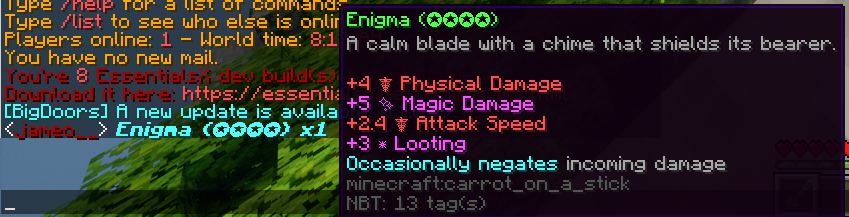

# **Features**

## **Achievements**

#### **Commands:**
/aach list
/aach stats
/aach top

## **AngelChest**

All players, upon dying, will leave behind a grave at their location of death. Once respawned, players are given:
- The coordinates of their grave via chat
- A compass that points to their grave
Graves last for <u>10 minutes</u>. Once the ten minutes are up, the contents of the chest are dropped on the ground. Only the player who dies has access to the chest. A player can have a maximum of 5 chests; once the max is exceeded, items from the first chest drop on the ground.

## **Animated Architecture**
Players can create several different animated structures using this plugin, such as:

- Big Doors
- Clocks (that display in-game time)
- Drawbridges
- Flags
- Garage Doors
- Portcullises
- Revolving Doors
- Sliding Doors
- Windmills

More info can likely be found somewhere on the [Animated Architecture Spigot Page](https://www.spigotmc.org/resources/animatedarchitecture.122642/)

## **Block Locker**

BlockLocker allows players to lock their private chests, furnaces, barrels, and any other containers from being used by other players. BlockLocker can also lock doors of all types.

#### **Editing a BlockLocker sign**

If a player wants to share a container with other players, they can right-cilck the sign. Adding usernames to the third and fourth row of the sign will allow others to access your container or door. There are also a few additional tags that can be added:

- [Everyone] - Gives everyone access to the block
- [Redstone] - Grants hoppers access to a container and allows redstone to open and close doors.
- [Timer:X] - Doors automatically close after the specified amount of seconds

## **Chat [Item]**
Using [item] or {item} in a chat message will display the player's held item. The item can be hovered by anyone to see its specifics.

## **Cosmetics**
Cosmetics can be earned on this server by buying and opening Treasure Chests with money earned from Jobs or other players. Chests cost $3,000 and open 4 at a time. This server features custom cosmetics, including:

- Pets
- Particle Effects
- Hats
- Emotes
- Projectile Effects
- Death Effects

#### Commands:

/uc menu - opens the cosmetic menu

Pets do not attack, and no effects will change anything major about gameplay. Don’t expect much from the emotes.

## **DropHeads**
All mobs have a % chance of dropping their heads

## **Dynmap (New UI)**
A server map can be found at this link: [Corporate Minecraft Dynmap](http://51.81.179.42:28126/)

## **Jameo Enchantment Control**
Enchantments are limited on this server to adjust for difficulty changes. The following enchantments are unobtainable (except for custom armor drops and crafting):
- Sharpness IV & V
- Protection III & IV

## **GSit**
Players can sit on stairs, sit on other players, and /crawl on the ground. Sitting is done by right-clicking (or shfit-right clicking other players)

## **Health Bars**
Mobs and players have health bars above their head indicating their current and total HP

## **Jobs**
Jobs are players' main method of earning money. By default, all players are assigned to all jobs upon joining the server. These jobs are:

- Brewer
- Builder
- Crafter
- Digger
- Enchanter
- Explorer
- Farmer
- Fisherman
- Hunter
- Miner
- Weaponsmith
- Woodcutter

## **McMMO**
McMMO is an RPG-styled skills plugin that allows you to level up different Minecraft skills like Mining, Excavation, and Swords. Unlike Jobs, whose level-ups are cosmetic, McMMO abilities are dependent on your skill level and boost various parts of your experience. For example, Mining’s Double Drops increases in chance as your Mining level increases. Skills are leveled 0-99. Full documentation can be found on the [McMMO Wiki](https://wiki.mcmmo.org/)

#### Commands:
- /mcstats (player) - shows a player’s (or your own) McMMO stats
- /mctop (skill) - shows the server’s top members in specified skill
- /mcrank (player) - shows a player’s (or your own) skill ranks
- /(skill) - shows information about a specific skill, including abilities

## **PyroMining**
PyroMining adds many different functions that completely revamp the mning experience. The feature list is provided below and more details can be found at the [PyroMining Spigot page](https://www.spigotmc.org/resources/pyromining-1-14-x-1-21-x-v4-0-0-update-artifacts-fossils-and-vessels.59867/) as well as the [PyroMining Wiki](./pyromining.md)

- Fluxes - Orbs you can find when mining certain ores which can then be sold to a mining market.
- Gemstones - These Gemstones will have more features in the future. They can currently be sold to the mining market as well.
- Rune Dust - Gained from Refining 'Mysterious Dust' in a Refinery. Used to summon Rune Guardians to earn runes.
- Refinery - A multi-block structure that allows you to grind Mysterious Dust down into other useful items. See the spoiler on how to make one.
- Runes - You get these from killing Rune Guardians. You summon these with Rune Dust by clicking on Redstone Ore. Runes are like a custom currency and used to unlock things / use items.
- Zeta - This is the custom currency for mining. You can get Zeta from breaking ores when mining.
- Singularity - Kill Rune Guardians to harness their power and upgrade skills to aid you on your journey throughout PyroMining.
- Vessels - Custom Enchantments for pickaxes
- Artifacts and Fossils - Unique drop tables that rewards players for mining.
- Mining Level & Skill Tree - This is used to spend skill points on perks, such as increasing your Zeta gain.
- Oracles - These are end-game bosses that you can fight using Oracleite. These Oracles will drop mining related things.

## **Multiverse**

There are currently SIX realms available on the server. The first three are standard Minecraft dimensions, with more advanced terrain generation:

#### Grynn:

#### Scorch:

#### Veil:

Once these three dimensions are beat by the player (including killing all custom bosses) they can access the Shattered Realms, uniquely generated worlds that offer entirely new experiences:

#### Airthaal:

#### Nohrm:

After beating these dimensions, players will be able to travel to Iskk, a harsh world made entirely out of snow biomes.

## **Custom Mobs**

This server features over 100 custom mobs, each of which has its own unique flare, drops, loadouts, etc.

Some custom mobs have 

## **Custom Bosses**

This server features eight custom bosses. Of the first three dimensions (Grynn, Scorch, and Nohrm), there are one boss each with a fourth boss able to be summoned after killing all three. The Shattered Realms dimensions (Airthaal and Nohrm) follow a similar structure - one boss on each world, and a final boss summoned after killing them. Iskk has a boss as well.

***These bosses are meant to be very difficult.*** You should come as prepared as possible to fight them. Or cheese them, if you want to ruin all of my hard work.

## **Custom Items**

This server features over a hundred custom items, ranging largely from armor to weapons. These are discussed in more detail in [Custom Items](./custom_items.md).

## **Pets**
Pets are purchased with money and can be used for a variety of purposes. Upon purchasing a pet, you will be prompted to select a *skill tree* for the pet - skill trees cannot be changed and determine what the pet can do. Some skill trees allow for a stronger combat pet, others allow for rideable pets or pet inventories. More pet info can be found on the [MyPet Wiki](https://wiki.mypet-plugin.de/)

Pets gain XP by killing mobs.

#### **Commands**
- /petshop - opens the pet shop
- /pets - view your pet storage
- /petstore - stores your active pet
- /petstats - view your pet's stats
- /pcst - chooses a skill tree; you will be prompted to do this after purchasing a pet
- /petrelease - releases a pet into the wild

## **Slimefun**
Slimefun is a plugin that adds hundreds of materials, machines, tools, and armor to Minecraft. Slimefun’s full documentation can be found on the [Slimefun Wiki](https://github.com/Slimefun/Slimefun4/wiki)

A few items have been removed for balancing purposes, with the goal of making it so that you shouldn’t have to use Slimefun to have a good experience. It’s meant to be a neat addition to the vanilla game, especially the late game.

#### Commands:
- /sf guide - gives the user a Slimefun book. Right-clicking with the book in hand opens Slimefun’s user-friendly GUI.
- /sf open_book - opens the Slimefun book without needing it in your inventory
- /sf search <query> - searches the Slimefun book
- /sf stats <player> - shows a player’s (or your own) Slimefun stats

## **Tags**
In chat, you will have a tag next to your name. More tags are earned by completing achievements, which can be viewed using /aach list. Achievements that give a tag for completing are marked by (TAG) in the achievement's description. Most tags are the same as the achievement necessary to obtain them, but not all.

## **ViaVersion**
Corporate Minecraft runs on 1.20.2 due to plugin compatibility issues - but ViaVersion allows you to join from a variety of Minecraft versions. This has not been thoroughly tested. ***I would not joing from any version before 1.20.2.***
